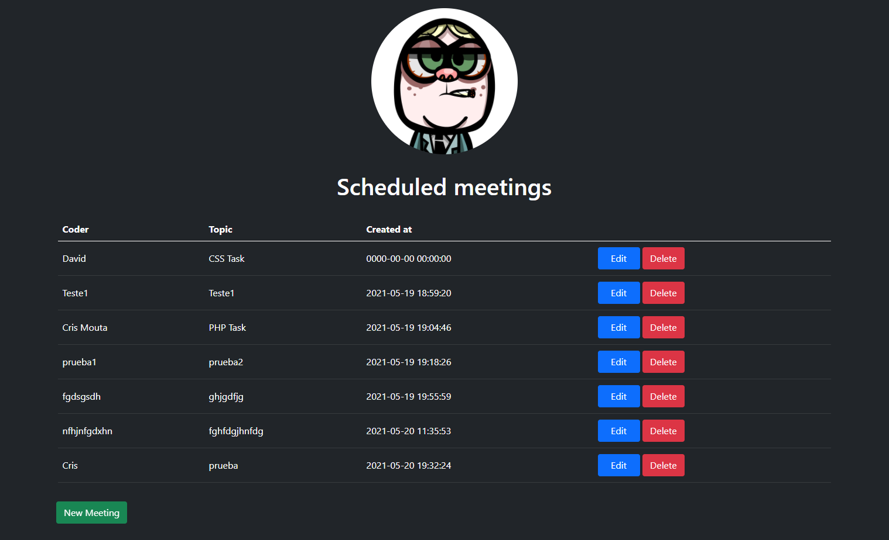
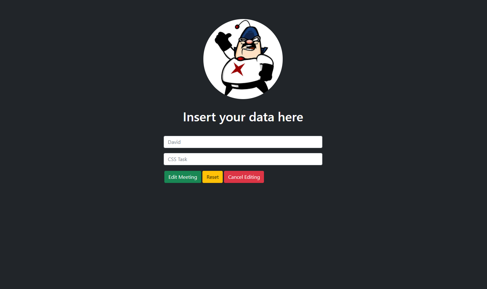
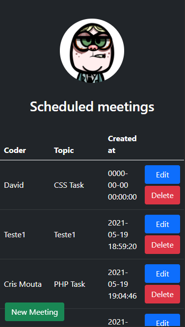
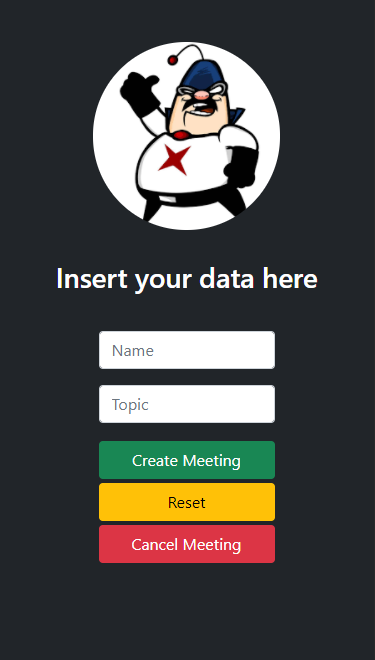

# El consultorio

Este proyecto consiste en una aplicación CRUD que permite a los desarrolladores pedir cita al formador para solucionar problemas técnicos.
La app es responsive y desarrollada con PHP orientado a objetos usando el patrón MVC.

## Miembros del equipo de desarrollo

* David Sánchez
* Snezhanna Stefanova
* Diego González
* Cris Mouta
* David Hermoso de Mendoza

## Servidor en producción

http://coolder.herokuapp.com/

## Características de la app

La app consta de 3 vistas:
* Lista de citas ya solicitadas. Las citas aparecen por orden de creación, con el nombre del coder, el tema de la consulta, fecha y hora de la creación de la cita.
Es posbible borrar o editar una cita ya existente, y de pedir una nueva cita.

* Página de creación de una nueva cita que muestra los campos necesarios además de botones para borrar el texto de los campos, para confirmar y enviar la información y para cancelar y volver a la lista de citas.

* Página de edición de una cita que muestra los campos necesarios además de botones para borrar el texto de los campos, para confirmar y enviar la información y para cancelar y volver a la lista de citas.

## Vista previa de escritorio

## Vista previa de móvil

  
  

## Herramientas y tecnologías utilizadas

* HTML5
* CSS
* PHP8
* MySQL
* Visual Studio Code
* XAMPP
* Trello
* Poker planning
